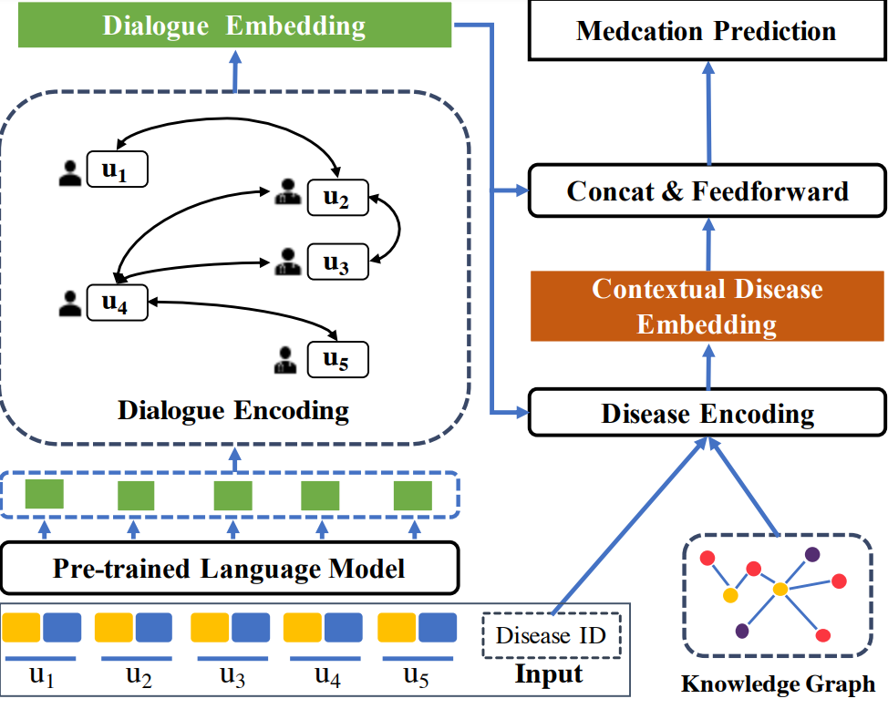

# DialMed


This repository is the code and data for ***DialMed: A Dataset for Dialogue-based Medication Recommendation.***




Figue 1: This is the framework of DDN(**D**ialogue structure and **D**isease knowledge aware **N**etwork) which is a model aiming to dialogue based medication recommendation.


**Requirements**

```
pytorch
numpy
sklearn
transformers
tqdm
```


**Usage**

For the train of  DDN , 

```python
python train.py
```


**File Tree**

```
DialMed
├── LICENSE
├── README.md
├── code
│   ├── data.py
│   ├── train.py
│   └── model.py
└── data
    └── dataset
        ├── dataset_example.txt
        ├── train.txt
        ├── test.txt
        └── dev.txt
```


**Notes**

The code and data are the part of the original version.
And core code and all data will be made public if the paper is accepted.

